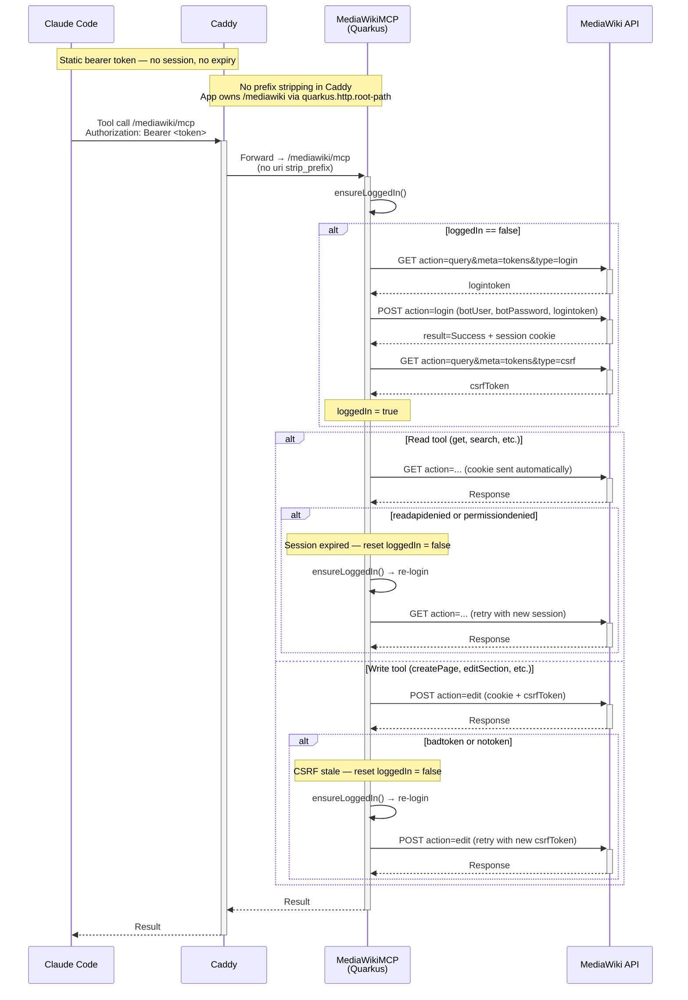

# MediaWikiMCP — MediaWiki MCP Server

A Quarkus MCP (Model Context Protocol) server that connects Claude to a [MediaWiki](https://www.mediawiki.org) instance. Lets Claude read and write pages, search content, navigate categories and namespaces — from Claude Desktop or Claude Code.

## Stack

- **Java 21**, Quarkus 3.33.1, [quarkus-mcp-server](https://github.com/quarkiverse/quarkus-mcp-server) 1.12.0
- **MCP transport:** Streamable HTTP (MCP protocol 2025-11-25)
- **MCP endpoint:** `/mediawiki/mcp`
- **Health endpoint:** `/mediawiki/health`
- **Auth:** MediaWiki bot password (`Special:BotPasswords`)

## Tools (15)

| Class | Tool | What it does |
|-------|------|--------------|
| PageTools | `getPage` | Get wikitext content of a page |
| PageTools | `getSections` | List all sections with index, level and title |
| PageTools | `getSection` | Get wikitext of a single section by index |
| PageTools | `createPage` | Create or overwrite a page (optional `templateTitle` preloads an existing page as base) |
| PageTools | `appendToPage` | Append wikitext to an existing page |
| PageTools | `appendToSection` | Append to a section without overwriting (safe for journal-style edits) |
| PageTools | `editSection` | Edit a single section by index |
| PageTools | `getPageHistory` | Revision history with revids, timestamps, editors and summaries |
| SearchTools | `search` | Keyword search with optional namespace filter |
| SearchTools | `prefixSearch` | List pages by title prefix (e.g. `Journal:2026-04`) |
| SearchTools | `getBacklinks` | Find pages that link to a given page |
| SearchTools | `listNamespaces` | List all namespaces with their numeric IDs |
| SearchTools | `listRecentChanges` | Recent edits with title, editor, timestamp, summary |
| CategoryTools | `listCategory` | List all pages in a category |
| CategoryTools | `getPageCategories` | List all categories on a page |

## Configuration

| Env var | Default | Description |
|---------|---------|-------------|
| `MEDIAWIKI_URL` | *(required)* | Full URL to your wiki's API, e.g. `https://wiki.example.com/api.php` |
| `MEDIAWIKI_BOT_USER` | *(required)* | Bot username in `User@BotName` format |
| `MEDIAWIKI_BOT_PASSWORD` | *(required)* | Bot password from `Special:BotPasswords` |

Create a bot password: MediaWiki → `Special:BotPasswords` → create with read + edit permissions.

## Use with Claude Desktop

Add to `claude_desktop_config.json`:

**Remote (hosted):**
```json
{
  "mcpServers": {
    "mediawiki": {
      "command": "npx",
      "args": [
        "mcp-remote",
        "https://your-mcp-host/mediawiki/mcp"
      ]
    }
  }
}
```

**Local (running on your machine):**
```json
{
  "mcpServers": {
    "mediawiki": {
      "command": "npx",
      "args": [
        "mcp-remote",
        "http://localhost:8081/mediawiki/mcp"
      ]
    }
  }
}
```

Config file locations:
- **macOS:** `~/Library/Application Support/Claude/claude_desktop_config.json`
- **Windows:** `%APPDATA%\Claude\claude_desktop_config.json`

Restart Claude Desktop after editing.

## Run locally

```bash
export MEDIAWIKI_URL=https://wiki.example.com/api.php
export MEDIAWIKI_BOT_USER=YourUser@BotName
export MEDIAWIKI_BOT_PASSWORD=your_bot_password
./mvnw quarkus:dev
```

Server starts on port 8081. Test it:
```bash
curl http://localhost:8081/mediawiki/health
```

## Run with Docker

```bash
docker build -t mediawiki-mcp .
docker run -p 8081:8081 \
  -e MEDIAWIKI_URL=https://wiki.example.com/api.php \
  -e MEDIAWIKI_BOT_USER=YourUser@BotName \
  -e MEDIAWIKI_BOT_PASSWORD=your_bot_password \
  mediawiki-mcp
```

## Deploy to AWS (CI/CD)

This repo includes a GitHub Actions workflow (`.github/workflows/deploy.yml`) that runs on every push to `main`:

```
push to main
  → build Docker image
  → push to ECR
  → SSH deploy to EC2
```

### Required GitHub Secrets

| Secret | Description |
|--------|-------------|
| `AWS_ACCESS_KEY_ID` | IAM user with ECR push permissions |
| `AWS_SECRET_ACCESS_KEY` | Corresponding secret key |
| `EC2_HOST` | Public IP of your EC2 instance |
| `EC2_SSH_KEY` | Contents of your `.pem` key file |
| `MEDIAWIKI_BOT_USER` | Passed to the container at runtime |
| `MEDIAWIKI_BOT_PASSWORD` | Passed to the container at runtime |

### AWS setup summary

- **ECR** — container registry in your region
- **EC2** — t3.micro, Amazon Linux 2023, Docker installed
- **IAM role on EC2** — `AmazonEC2ContainerRegistryReadOnly`
- **IAM user for CI** — ECR push permissions only
- **Caddy** — reverse proxy on EC2 for HTTPS + automatic Let's Encrypt cert

## Auth model

Two auth layers: a static bearer token at Caddy (edge), and a cookie-based bot session to MediaWiki.



- **Caddy layer:** static bearer token, validated on every request — no sessions, no timeouts
- **MediaWiki layer:** cookie-based bot session — can expire, requires re-authentication
- Session cookies managed by `CookieManager` in `HttpClient`, sent automatically
- `loggedIn` flag prevents unnecessary re-logins; reset on any auth failure

## Design notes

- Lazy login — `ensureLoggedIn()` called before each request; no startup crash if wiki is unreachable
- CSRF token cached for session lifetime, re-fetched on `badtoken` response
- GET requests retry on `readapidenied`/`permissiondenied` — transparent re-auth on session expiry
- All tools return plain strings — no model POJOs
- Wiki must have bot passwords enabled (`$wgEnableBotPasswords = true`, default on MediaWiki 1.27+)
