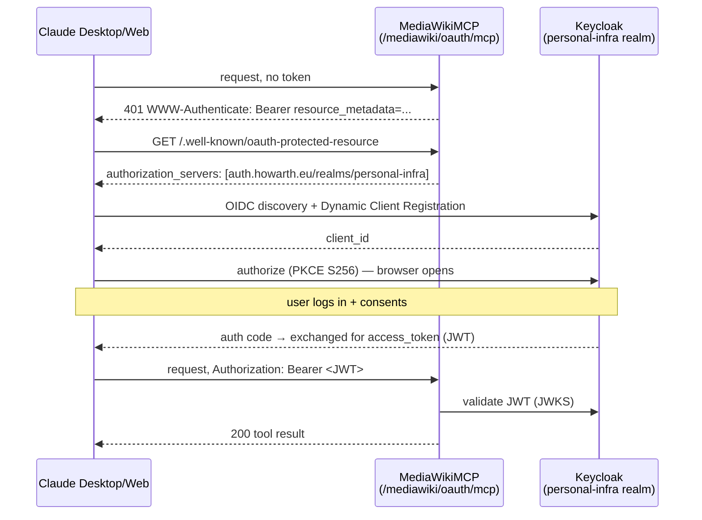
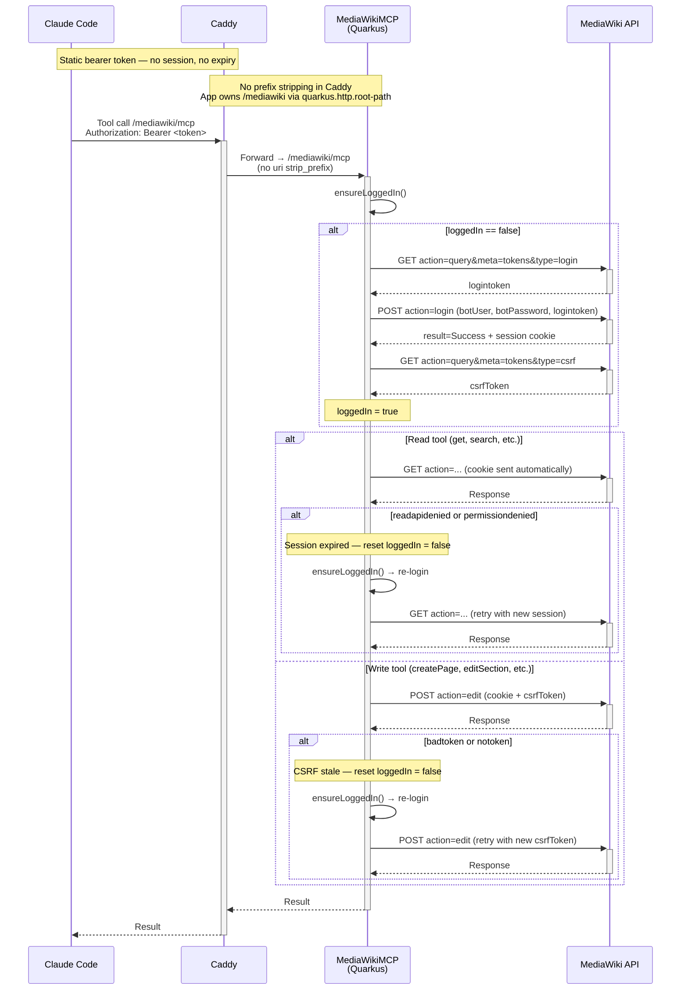

# MediaWikiMCP — MediaWiki MCP Server

A Quarkus MCP (Model Context Protocol) server that connects Claude to a [MediaWiki](https://www.mediawiki.org) instance. Lets Claude read and write pages, search content, navigate categories and namespaces — from Claude Desktop or Claude Code.

## Stack

- **Java 25**, Quarkus 3.33.1, [quarkus-mcp-server](https://github.com/quarkiverse/quarkus-mcp-server) 1.12.0
- **Deploy artifact:** GraalVM/Mandrel **native image** (~20 MB resident), fronted by Caddy
- **MCP transport:** Streamable HTTP (MCP protocol 2025-11-25)
- **MCP endpoint:** `/mediawiki/mcp`
- **Health endpoint:** `/mediawiki/health` publicly (via Caddy); the app itself serves health at `/health` on 8081 (the `smallrye-health` root-path is absolute, independent of the `/mediawiki` http root-path)
- **Auth:** MediaWiki bot password (`Special:BotPasswords`)

## Tools (15)

| Class | Tool | What it does |
|-------|------|--------------|
| PageTools | `getPage` | Get wikitext content of a page |
| PageTools | `getSections` | List all sections with index, level and title |
| PageTools | `getSection` | Get wikitext of a single section by index |
| PageTools | `createPage` | Create or overwrite a page (optional `templateTitle` preloads an existing page as base) |
| PageTools | `appendToPage` | Append wikitext to an existing page |
| PageTools | `appendToSection` | Append to a section without overwriting (safe for journal-style edits) |
| PageTools | `editSection` | Edit a single section by index |
| PageTools | `getPageHistory` | Revision history with revids, timestamps, editors and summaries |
| SearchTools | `search` | Keyword search with optional namespace filter |
| SearchTools | `prefixSearch` | List pages by title prefix (e.g. `Journal:2026-04`) |
| SearchTools | `getBacklinks` | Find pages that link to a given page |
| SearchTools | `listNamespaces` | List all namespaces with their numeric IDs |
| SearchTools | `listRecentChanges` | Recent edits with title, editor, timestamp, summary |
| CategoryTools | `listCategory` | List all pages in a category |
| CategoryTools | `getPageCategories` | List all categories on a page |

## Configuration

| Env var | Default | Description |
|---------|---------|-------------|
| `MEDIAWIKI_URL` | *(required)* | Full URL to your wiki's API, e.g. `https://wiki.example.com/api.php` |
| `MEDIAWIKI_BOT_USER` | *(required)* | Bot username in `User@BotName` format |
| `MEDIAWIKI_BOT_PASSWORD` | *(required)* | Bot password from `Special:BotPasswords` |

Create a bot password: MediaWiki → `Special:BotPasswords` → create with read + edit permissions.

## Use with Claude Desktop

Add to `claude_desktop_config.json`:

**Remote (hosted):**
```json
{
  "mcpServers": {
    "mediawiki": {
      "command": "npx",
      "args": [
        "mcp-remote",
        "https://your-mcp-host/mediawiki/mcp"
      ]
    }
  }
}
```

**Local (running on your machine):**
```json
{
  "mcpServers": {
    "mediawiki": {
      "command": "npx",
      "args": [
        "mcp-remote",
        "http://localhost:8081/mediawiki/mcp"
      ]
    }
  }
}
```

Config file locations:
- **macOS:** `~/Library/Application Support/Claude/claude_desktop_config.json`
- **Windows:** `%APPDATA%\Claude\claude_desktop_config.json`

Restart Claude Desktop after editing.

> This local `mcpServers` config is a separate mechanism from Claude's newer [Connectors](https://claude.com/docs/connectors/building) feature (Settings → Connectors), which is what Claude Desktop/web/mobile/Cowork actually need for a one-click "Add Connector" setup rather than editing a JSON file. See **OAuth (Claude Connectors)** below.

## OAuth (Claude Connectors) — recommended for Desktop/web/mobile

Add via Claude → Settings → Connectors → Add Connector, URL:

```
https://your-mcp-host/mediawiki/oauth/mcp
```

Claude drives the whole flow itself — discovery, registration, browser consent, token refresh — nothing to configure beyond entering the URL. This is a *separate, additive* endpoint: the bearer-token `mcpServers` setup above (used by Claude Code) is completely untouched and keeps working exactly as before.


```mermaid
sequenceDiagram
    participant D as Claude Desktop/Web
    participant M as MediaWikiMCP<br/>(/mediawiki/oauth/mcp)
    participant K as Keycloak<br/>(personal-infra realm)

    D->>M: request, no token
    M-->>D: 401 WWW-Authenticate: Bearer resource_metadata=...
    D->>M: GET /.well-known/oauth-protected-resource
    M-->>D: authorization_servers: [auth.howarth.eu/realms/personal-infra]
    D->>K: OIDC discovery + Dynamic Client Registration
    K-->>D: client_id
    D->>K: authorize (PKCE S256) — browser opens
    Note over D,K: user logs in + consents
    K-->>D: auth code → exchanged for access_token (JWT)
    D->>M: request, Authorization: Bearer <JWT>
    M->>K: validate JWT (JWKS)
    M-->>D: 200 tool result
```

Same recipe as [KanbanMCP](https://github.com/marcushowarth/KanbanMCP)'s OAuth support (#966) — `/mediawiki/oauth/mcp` is a second, OIDC-secured `quarkus-mcp-server` instance exposing the same tools, backed by Keycloak's `personal-infra` realm (the same `marcus` end-user account used for the KanbanMCP Connector).

## Run locally

```bash
export MEDIAWIKI_URL=https://wiki.example.com/api.php
export MEDIAWIKI_BOT_USER=YourUser@BotName
export MEDIAWIKI_BOT_PASSWORD=your_bot_password
./mvnw quarkus:dev
```

Server starts on port 8081. Test it (the app serves health at `/health`):
```bash
curl http://localhost:8081/health
```

## Build and run native

```bash
# Build the native image (Linux binary via the Mandrel builder container — needs Docker)
./mvnw package -Dnative -Dquarkus.native.container-build=true \
  -Dquarkus.native.builder-image=quay.io/quarkus/ubi9-quarkus-mandrel-builder-image:jdk-25

# Wrap the runner in the runtime image and run it
docker build -f src/main/docker/Dockerfile.native -t mediawiki-mcp .
docker run -p 8081:8081 \
  -e MEDIAWIKI_URL=https://wiki.example.com/api.php \
  -e MEDIAWIKI_BOT_USER=YourUser@BotName \
  -e MEDIAWIKI_BOT_PASSWORD=your_bot_password \
  mediawiki-mcp
```

A JVM build (`./mvnw package` then `java -jar target/quarkus-app/quarkus-run.jar`) is the fallback if a native build is ever unavailable.

## Deploy (CI/CD)

This repo includes a GitHub Actions workflow (`.github/workflows/deploy.yml`) that runs on every push to `main`:

```
push to main
  → build native image + run native integration test (verify -Dnative)
  → build runtime Docker image (Dockerfile.native)
  → push to GHCR
  → SSH deploy to host (docker pull + docker run + image prune)
```

A separate `ci.yml` runs `verify` (tests only, no deploy) on every branch and pull request. Doc- and workflow-only changes don't trigger a deploy (`paths-ignore`).

**History:** originally deployed to AWS (EC2 + ECR). Migrated to Hetzner Cloud on 2026-07-24 — the first application of a "prove on big cloud, port to cheap dedicated once mature" hosting strategy. Full writeup in the wiki `Projects:MediaWikiMCP` Decision Log.

### Required GitHub Secrets

| Secret | Description |
|--------|-------------|
| `HETZNER_HOST` | Public IP of your host |
| `HETZNER_SSH_KEY` | SSH private key for the deploy user |
| `MEDIAWIKI_BOT_USER` | Passed to the container at runtime |
| `MEDIAWIKI_BOT_PASSWORD` | Passed to the container at runtime |

GHCR auth uses the built-in `GITHUB_TOKEN` — no registry credentials to manage.

### Host setup summary

- **GHCR** — `ghcr.io/marcushowarth/mediawiki-mcp`, authenticated via `GITHUB_TOKEN`
- **Host** — any Docker-capable box reachable over SSH (currently a Hetzner CX23)
- **Deploy user** — dedicated, own SSH key, docker group (not root)
- **Caddy** — reverse proxy on the host for HTTPS + automatic Let's Encrypt cert

## Auth model (bearer token / Claude Code)

See [OAuth (Claude Connectors)](#oauth-claude-connectors--recommended-for-desktopwebmobile) above for the Desktop/web/mobile path — this section covers the original bearer-token path, still used by Claude Code. Two auth layers: a static bearer token at Caddy (edge), and a cookie-based bot session to MediaWiki.


```mermaid
sequenceDiagram
    participant CC as Claude Code
    participant C as Caddy
    participant MCP as MediaWikiMCP<br/>(Quarkus)
    participant MW as MediaWiki API

    Note over CC,C: Static bearer token — no session, no expiry
    Note over C,MCP: No prefix stripping in Caddy<br/>App owns /mediawiki via quarkus.http.root-path

    CC->>+C: Tool call /mediawiki/mcp<br/>Authorization: Bearer <token>
    C->>+MCP: Forward → /mediawiki/mcp<br/>(no uri strip_prefix)
    MCP->>MCP: ensureLoggedIn()

    alt loggedIn == false
        MCP->>+MW: GET action=query&meta=tokens&type=login
        MW-->>-MCP: logintoken
        MCP->>+MW: POST action=login (botUser, botPassword, logintoken)
        MW-->>-MCP: result=Success + session cookie
        MCP->>+MW: GET action=query&meta=tokens&type=csrf
        MW-->>-MCP: csrfToken
        Note over MCP: loggedIn = true
    end

    alt Read tool (get, search, etc.)
        MCP->>+MW: GET action=... (cookie sent automatically)
        MW-->>-MCP: Response
        alt readapidenied or permissiondenied
            Note over MCP: Session expired — reset loggedIn = false
            MCP->>MCP: ensureLoggedIn() → re-login
            MCP->>+MW: GET action=... (retry with new session)
            MW-->>-MCP: Response
        end
    else Write tool (createPage, editSection, etc.)
        MCP->>+MW: POST action=edit (cookie + csrfToken)
        MW-->>-MCP: Response
        alt badtoken or notoken
            Note over MCP: CSRF stale — reset loggedIn = false
            MCP->>MCP: ensureLoggedIn() → re-login
            MCP->>+MW: POST action=edit (retry with new csrfToken)
            MW-->>-MCP: Response
        end
    end

    MCP-->>-C: Result
    C-->>-CC: Result
```

- **Caddy layer:** static bearer token, validated on every request — no sessions, no timeouts
- **MediaWiki layer:** cookie-based bot session — can expire, requires re-authentication
- Session cookies managed by `CookieManager` in `HttpClient`, sent automatically
- `loggedIn` flag prevents unnecessary re-logins; reset on any auth failure

## Design notes

- Lazy login — `ensureLoggedIn()` called before each request; no startup crash if wiki is unreachable
- CSRF token cached for session lifetime, re-fetched on `badtoken` response
- GET requests retry on `readapidenied`/`permissiondenied` — transparent re-auth on session expiry
- All tools return plain strings — no model POJOs
- Wiki must have bot passwords enabled (`$wgEnableBotPasswords = true`, default on MediaWiki 1.27+)
